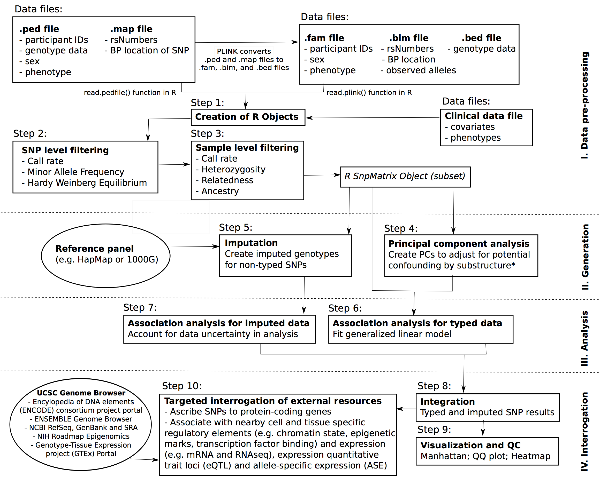

```{r setup, include=FALSE}
knitr::opts_chunk$set(cache=TRUE)
```

This tutorial presents fundamental concepts and specific software tools for implementing a complete genome wide association (GWA) analysis, as well as post-analytic visualization and interrogation of potentially novel findings.  In this tutorial we use complete GWA data on 1401 individuals from the [PennCATH study of coronary artery disease (CAD)](http://link-here/).

The tutorial follows the steps described in the following workflow diagram.



## Installing necessary packages

Before beginning, make sure that all the necessary dependencies are installed using R version 3 as follows:

```{r cache=FALSE, echo=FALSE}
knitr::read_chunk('code0.r')
```
```{r code0, eval=FALSE}
```

## Configuring global parameters

We first attempt to isolate most of the variable parameters used in the data processing and analysis.  Of particular note, users should set the location of the GWA data set.  Other variables here specify input and output.  Some analysis threshold parameters are also included.

```{r cache=FALSE, echo=FALSE}
knitr::read_chunk('globals.R')
```
```{r globals}
```

## Data pre-processing

First we use the `read.plink` function in the *snpStats* package to read the genotype data from the collection of `.bfam`, `.bim` and `.bed` files.  


```{r cache=FALSE, echo=FALSE}
knitr::read_chunk('code1.r')
```
```{r code1-a}
```

The `geno` object contains a `genotype` member of type `snpMatrix` where each column is a SNP and each row is a sample.  For convenience, we assign that to the variable `genotype`.  `geno` also contains a table of information about each sample, called a `map` that we assign to `genoBim`.

```{r code1-b}
```

Supplemental clinical data is found in a corresponding CSV file for each sample ID.
```{r code1-c}
```

We then filter the genotype data to only include samples with corresponding clinical data by indexing the SnpMatrix using the sample IDs, which match the row names.

```{r code1-d}
```

## SNP level filtering

```{r cache=FALSE, echo=FALSE}
knitr::read_chunk('code2.r')
```

Once the data is loaded, we are ready to remove SNPs that fail to meet
minimum criteria due to missing data, low variability or genotyping
errors.  *snpStats* provides `col.summary` and `row.summary` functions
that return statistics on SNPs and samples, respectively.

```{r code2-a}
```

Using these summary statistics, we keep the subset of SNPs that our criteria for minimum call rate and variability.

```{r code2-b}
```

## Sample level filtering

The second stage of data pre-processing involves filtering samples,
i.e. removing individuals due to missing data, sample contamination,
correlation (for population-based investigations) and racial/ethnic or
gender ambiguity or discordance.  In our study, we address these
issues by filtering on call rate, heterozygosity, cryptic relatednes
and duplicates using identity-by-descent, and we visually assess
ancestry.

```{r cache=FALSE, echo=FALSE}
knitr::read_chunk('code3.r') 
```

### Basic sample filtering

Filtering samples is achieved using `row.summary`, 
augmented by an additional heterozygosity F statistic.

```{r code3-a}
```

We then apply filtering on call rate and heterozygosity, selecting only 
those samples that meet our criteria.

```{r code3-b}
```

### IBD analysis

In addition to these summary statistics, we also want to filter on
relateness criteria.  We use the *SNPRelate* package to perform
identity-by-descent (IBD) analysis.  This package requires that the
data be transformed into a *GDS* format file.  IBD analysis is
performed on only a subset of SNPs that are in linkage equilibrium by
iteratively removing adjacent SNPs that exceed an LD threshold in a
sliding window (function `snpgdsLDpruning`).

```{r code3-c}
```

The `snpgdsIBDMoM` function computes the IBD coefficients using method
of moments.  The result is a table indicating kinship among pairs of
samples.

```{r code3-d}
```

Using the IBD pairwise sample relatedness measure, we iteratively
remove samples that are too similar using a greedy strategy in which
the sample with the largest number of related samples is removed.  The
process is repeated until there are no more pairs of samples with
kinship above our cut-off.

```{r code3-e}
```

### Ancestry

To better understand ancestry, we plot the first two principal
components of the genotype data.

```{r code3-f}
```

## SNP Filtering - HWE filtering on control samples

Finally, once samples are filtered, we return to SNP level filtering
and apply a check of Hardy-Weinberg equilibrium for just the study controls
and remove those that exceed our cut-off.

```{r code3-g}
```

## Re-compute PCA

With our final set of filtered SNPs and samples, we recompute the
principal components again to be used in later model fitting.

```{r cache=FALSE, echo=FALSE}
knitr::read_chunk('code4.r') 
```
```{r code4-a}
```


## Imputing non-typed SNPs
```{r cache=FALSE, echo=FALSE}
knitr::read_chunk('code5.r') 
```

## Imputation of SNPs

In addition to the genotyped SNPs from our study, it is useful to
extend the analysis to other known SNPs in our region of interest
(chromsome 16).  We retrieve additional SNPs from the HapMap project
using the *chopsticks* package.  Then we derive imputation rules based
on those SNPs present both in our study and HapMap.  Using these
rules, we impute the genotypes for all HapMap SNPs.

```{r code5-a}
```

## Genome-wide association analysis

```{r cache=FALSE, echo=FALSE}
knitr::read_chunk('code6.r') 
```
```{r cache=FALSE, echo=FALSE}
knitr::read_chunk('GWAA.R') 
```

Now that our data is loaded, filtered, and additional SNP genotypes
imputed, we are ready to perform genome-wide association analysis.
This involves regressing each SNP separately on a given trait,
adjusted for patient level clinical, demographic and environmental
factors.  Due to the large number of SNPs and the generally
uncharacterized relationships to the outcome, a simple single additive
model will be employed.  A Bonferonni corrected significant threshold
of $5 x 10^-8$ is used to control for family-wide error rate.

Due to the large number of models that require fitting, the GWA
analysis can be deployed in parallel across multiple processors or
machines to reduce the running time.  Here we demonstrate two basic
methods for performing parallel processing using the *doParallel*.
These approaches are demonstrated in the function GWAA:

### GWAA function

```{r gwaa}
```

### Phenotype data preparation

First we create a data.frame of phenotype features that is the
concatenation of clinical features and the first ten principal
components.  HDL is normalized.

```{r code6-a}
```

### Parallel model fitting

Using this phenotype data, we perform model fitting on each SNP and
write the results to a CSV file.

```{r code6-b}
```

## Post-analytic visualization and genomic integration

### Visualization and QC [QC] ###
