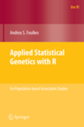

#Applied Statistical Genetics with R, First Edition

##For Population-based Association Studies

### *by Andrea Foulkes*

{:class="bio-photo"}This book is intended to provide fundamental statistical concepts and
R tools relevant to the analysis of genetic data arising from
population-based association studies.  The statistical methods
described are broadly relevant to the field of statistical genetics
and include a large array of tools for a wide variety of medical and
public health applications.  Data analytic methods include approaches
to handling multiplicity, ambiguity in haplotypic phase and underlying
gene-gene and gene-environment interactions.  Several publicly
available data sets are used for illustration. [Read More](http://www.springer.com/us/book/9780387895536)

